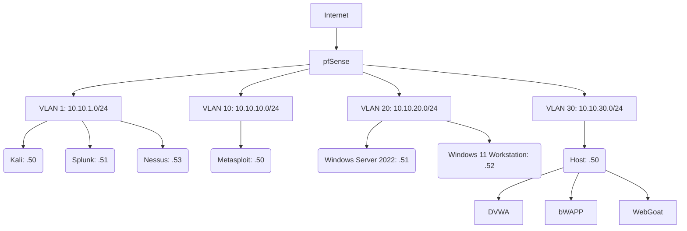

# 🛡️ Cybersecurity Homelab Deployment – Hands-On Security Engineering Lab

This project simulates a realistic enterprise network environment to develop skills in **network segmentation**, **log analysis**, and **security controls implementation**. Built on **Proxmox**, the lab includes multiple operating systems, offensive testing, and centralized log aggregation via Splunk.

---

## 🌐 Network Topology



---

## 🔧 Deployment Phases & Stack Overview

---

### Phase 1 – Network & Perimeter Security  
📘 [Phase 1 – Network & Perimeter Setup Guide](./phase-1-network.md)

- **pfSense Firewall**
  - 🔹 Manages **VLAN segmentation** across multiple subnets
  - 🔹 Provides **DHCP** to each VLAN (no reliance on Windows for VLANs outside VLAN 20)
  - 🔹 Acts as **internal DNS resolver**
  - 🔹 Enforces **firewall rules** to simulate restricted zones
  - 🔹 Logs firewall traffic and events to **Splunk via Syslog**

- **Kali Linux**
  - 🔹 Offensive testing tools: `Nmap`, `Hydra`, `Metasploit`, others
  - 🔹 Simulates attacker behavior to test detection across the environment
  - 🔹 Used to generate realistic log events and attack traffic

---

### Phase 2 – Vulnerable Targets  
📘 [Phase 2 – Vulnerable Targets Setup Guide](./phase-2-vulnerable-targets.md)

- **Ubuntu Server (Docker Host)**
  - 🔹 Runs intentionally vulnerable web apps:
    - `WebGoat`, `DVWA`, `bWAPP`
  - 🔹 Containerized to practice Docker networking and isolation
  - 🔹 Used to simulate low-hanging fruit commonly found during assessments

- **Metasploitable 2**
  - 🔹 Classic vulnerable Linux VM
  - 🔹 Used to test exploit delivery, lateral movement, and enumeration

---

### Phase 3 – Log Aggregation & Visibility  
📘 [Phase 3 – Log Aggregation & Visibility](./phase-3-splunk-visibility.md)

- **Splunk (Free Tier)**
  - 🔹 Ingests logs from:
    - pfSense firewall (via Syslog)
    - Ubuntu (via Universal Forwarder)
    - Nessus scan events
    - Windows Server & Windows 11 Workstation (via Universal Forwarder)
  - 🔹 Indexes created: `pf`, `nessus`, `win`, `infra`
  - 🔹 Use cases explored:
    - Port scanning
    - Failed login attempts
    - Privilege escalation
    - Suspicious PowerShell usage

- **Nessus Essentials**
  - 🔹 Internal vulnerability scanning
  - 🔹 Validates configuration gaps
  - 🔹 Helps simulate client environment assessment scenarios

---

### Phase 4 – Windows Enterprise Setup  
📘 [Phase 4 – Windows Setup & Services Guide](./phase4-WindowsServ-AD.md)

- **Windows Server 2022**
  - 🔹 Configured as Domain Controller (`reuben.local`)
  - 🔹 Services enabled: AD, DNS, DHCP (for VLAN 20)
  - 🔹 DHCP range: `10.10.20.100 – .120`
  - 🔹 Users added via PowerShell (bulk and admin accounts)
  - 🔹 Splunk Universal Forwarder installed (logs: Security, System, Application, etc.)

- **Windows 11 Workstation**
  - 🔹 DHCP from Windows Server
  - 🔹 Domain-joined
  - 🔹 Logged in as standard domain user
  - 🔹 Splunk Forwarder mirrors log setup
---

## 🛡️ Phase 5 – Security Hardening & Detection Layer

This phase focuses on implementing core blue-team controls across your homelab. Now that logging and visibility are in place, it's time to simulate threat surfaces, segment traffic, and lay the foundation for detection.

---

### 🔒 Firewall Rules & Network Segmentation

- Configure **PFsense** rules per VLAN
- Validate using test commands (e.g., ping from Kali to Win11)
- Document expected behavior vs observed

---

### 🐍 Nessus Vulnerability Scanning

- Deploy **Nessus Essentials** on Kali or dedicated VM
- Run scans against:
  - Windows Server (AD/DC)
  - Windows 11 endpoint
  - Metasploitable
  - Docker services
- Export and save vulnerability reports
- Tag notable findings for Splunk ingestion or alerting

---

### 🧠 Intrusion Detection – Suricata or Snort

- Deploy Suricata (on its own VM or inline with PFsense)
- Load default rule set (ET Open or similar)
- Trigger alerts via simulated attacks from Kali
- Confirm logs are forwarded to Splunk for visibility

---

### 🪵 Log Enrichment & Alert Testing

- Ensure logs from:
  - PFsense firewall blocks
  - Nessus scan results
  - Suricata alerts (if deployed)
- Are being ingested into **Splunk**
- Sample SPL Queries:
  ```spl
  index=firewall action=blocked
  index=nessus severity=high
  index=suricata alert.signature=*


---

## 🧪 Tools & Learning Focus

- **Nmap** – Network scanning and mapping
- **Hydra** – Brute-force attacks (SSH, RDP, web login)
- **Metasploit** – Exploit delivery and post-exploitation
- **Splunk** – Log analysis and detection rule development
- **pfSense** – Network control, segmentation, and traffic visibility
- **Windows Event Logs** – Correlating system behavior with real threats

---

## 💡 Why This Lab Exists

This is a practical, self-built lab designed to:

- Build intuition for how systems behave under real-world pressure
- See how common tools and attacks look in the logs
- Practice both attacker mindset and defensive architecture
- Go beyond certification — actually engineer, test, and learn

> Built to sharpen real-world awareness and skill.
